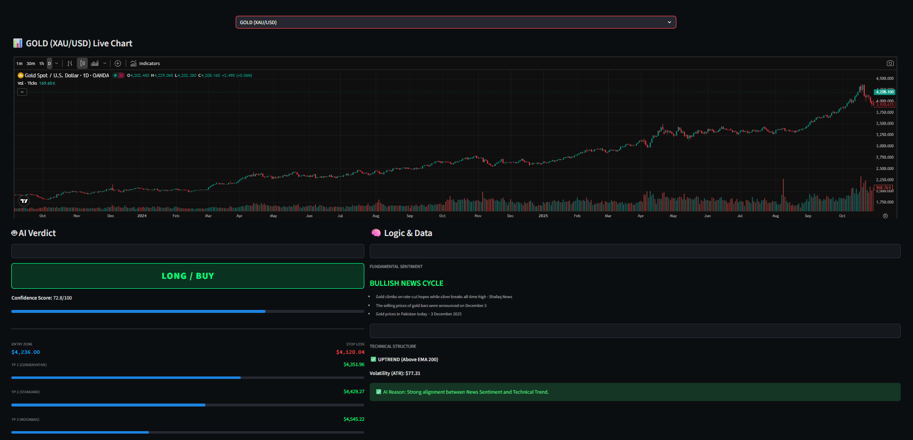

# 🦅 AlphaQuant Pro: AI Trading Intelligence Terminal

Ini adalah sistem intelijen pasar yang menggabungkan Analisis Fundamental (Sentimen Berita Live) dengan Analisis Teknikal (SMC & ATR) untuk menghasilkan sinyal trading dengan probabilitas tinggi.

## 🚀 Tampilan Dashboard

## 🎯 Fitur Unggulan
- **Analisis Multi-Aset:** Menganalisis Crypto (BTC, ETH), Komoditas (Gold), dan Forex.
- **Integrasi Berita Live:** Mengambil dan menganalisis sentimen dari berita terbaru secara real-time.
- **TP/SL Dinamis:** 3 Level Take Profit dengan probabilitas dinamis berdasarkan kekuatan sinyal.
- **Filter "No Trade":** AI akan merekomendasikan **"WAIT"** jika kondisi pasar tidak ideal untuk melindungi modal.
- **Chart Interaktif:** Menggunakan widget asli TradingView untuk analisis profesional.

## 🛠️ Teknologi
- Python, Streamlit
- TensorFlow, Scikit-learn
- Pandas_TA, GoogleNews, VADER Sentiment
